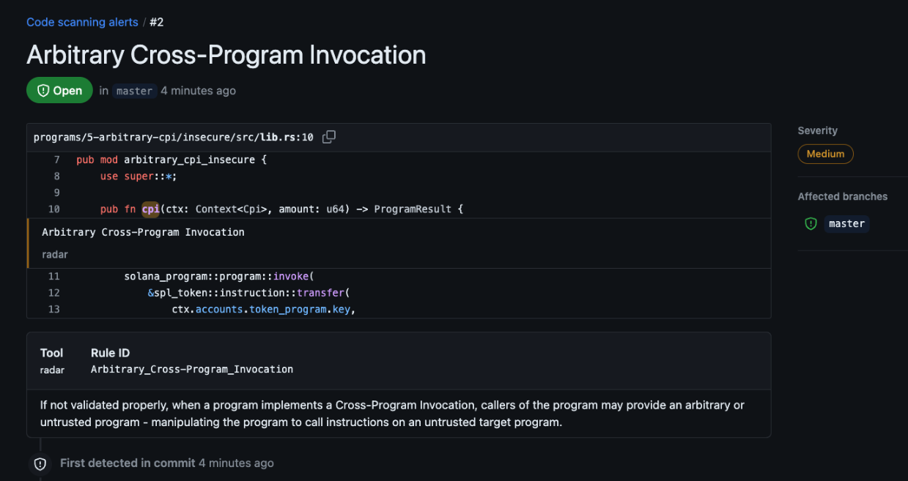

<br>
<br>

<p align="center">
  
</p>

<p align="center">

<a href="https://github.com/auditware/radar/issues/new/choose"></a>
<a href="https://github.com/auditware/radar/tree/main/api/builtin_templates"></a>
<a href="https://mybinder.org/v2/gh/auditware/radar/HEAD?labpath=demo.ipynb"></a>
<a href="https://discord.gg/8PTTMd96p4"></a>
<a href="https://github.com/auditware/radar/wiki"></a>
</p>

<br>

A static analysis tool for rust smart contracts 🦀

https://github.com/user-attachments/assets/62435714-cc5b-43f3-a213-96d28481a6d7

`radar` allows you to write, share, and utilize [templates](https://github.com/auditware/radar/tree/main/api/builtin_templates) to identify security issues in rust-based smart contracts using a powerful rule engine that enables automating detection of vulnerable code patterns, at scale, via simple python queries.

- [How to install](#installation)
- [How to run](#how-to-run)
- [Features](#-github-action)
  - [GitHub Action](#-github-action)
  - [Pre-commit Hook](#-pre-commit-hook)
- [Contributors](#contributors)

## Installation

1. Install and start [docker](https://docs.docker.com/get-started/get-docker/)

2. Install radar either from install script or from source

```bash
curl -L https://raw.githubusercontent.com/auditware/radar/main/install-radar.sh | bash
radar -p <your-contract-folder>
```

OR

```bash
git clone https://github.com/auditware/radar.git
cd radar
bash install-radar.sh
./radar -p <your-contract-folder>
```

<br>

## How to run

A good contract to first test radar against is the beautiful repo [sealevel-attacks](https://github.com/coral-xyz/sealevel-attacks)

```bash
git clone https://github.com/coral-xyz/sealevel-attacks
radar -p sealevel-attacks
```

Or you can quickly test on local mocks (from root dir) `./radar --dev -p ./api/tests/mocks/anchor-test-2`

To run a non-builtin template place a yaml file anywhere and reference it via `radar -p . -t <path_to_templats_dir>`

To explore more running options, see [All the ways to run radar](https://github.com/auditware/radar/wiki/Running-Options).

<br>

## GitHub Action

In a 10 seconds setup you can integrate [radar-action](https://github.com/Auditware/radar-action) and be alerted with radar's insights continuously through your contract repository.

<p>
  
</p>

<br>

## Pre-commit hook

If you're using [pre-commit](https://pre-commit.com), you could also add radar to your workflow by adding radar to your `.pre-commit-config.yaml` configuration like so:

```yaml
repos:
  - repo: local
    hooks:
      - id: run-radar
        name: Run radar Static Analysis
        entry: radar -p . --ignore low
        language: system
        stages: [commit]
        pass_filenames: false
        always_run: true
```

<br>

## Contributors

<div align="center">

<a href="https://github.com/forefy" style="display: inline-block; text-align: center; margin: 15px;">
  
  <sub><b>forefy</b></sub>
</a>
<a href="https://github.com/avigaildanesh" style="display: inline-block; text-align: center; margin: 15px;">
  
  <sub><b>avigaildanesh</b></sub>
</a>
<a href="https://github.com/brittcyr" style="display: inline-block; text-align: center; margin: 15px;">
  
  <sub><b>brittcyr</b></sub>
</a>

</div>


<br>

Either if you have a vulnerability to test in mind, or if you want to improve the quality of an existing one, templates are the best way to contribute to this repo!

### How to contribute

Open a PR to add your template to the built-ins ( See [How to write templates](https://github.com/auditware/radar/wiki/How-to-Write-Templates) ).


### We can help you to help!

We'd love to assist with writing your first template, and provide full guidance and support.

<br>

Check out the [Wiki](https://github.com/auditware/radar/wiki) for more details.

For support reach out to the Audit Wizard [Discord](https://discord.gg/8PTTMd96p4).
